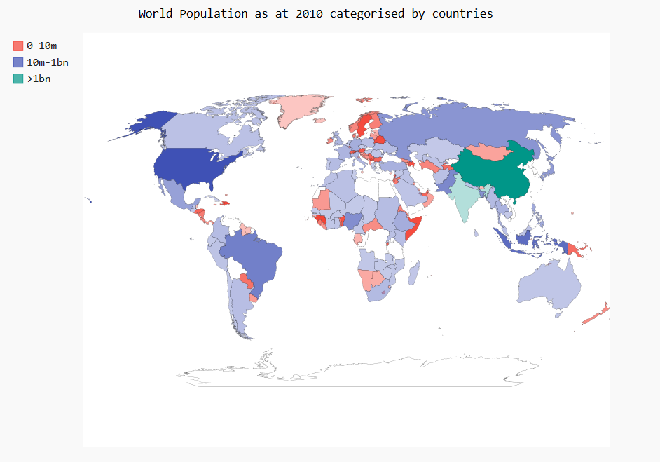
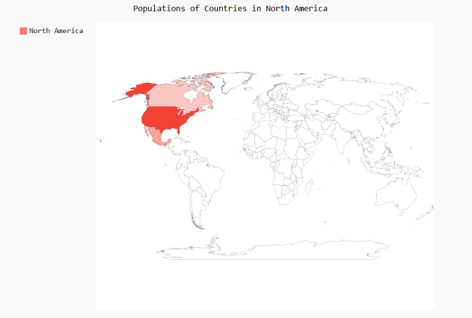
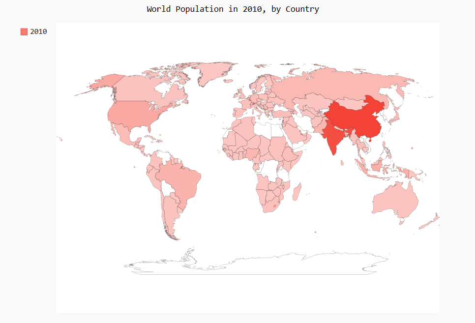

# Populations_Visualize

### Project Objectives:

1. Map out North, Central and South America from the World Map using colors
2. The World Population as at 2010 categorised based on countries  
3. Infographics of Populations as regards countries in North America
4. Infographics of the world population in 2010 by country,[The darker the region the more populated it is]

### Project Dependencies:
1. Pygal [Open Source Data Visualization Module]
2. Python 

### Project Overview: 
This project attempts to use Python to visualize the population of the AMERICAS[North, Central and South America], and then world 
population, it reads the population data from a json file and then visualizes the population data in the json file on a map in accordance to the numerical value of the population of the regions displayed on the map, all 
rendered in an svg file. The svg file can be viewed in the browser and an interactive visualization of the the map can be seen
through a browser
## 1.Mapping Out the AMERICAS from the world 
```
The image below shows North America, Central America
and South America
```


## 2.The world population as at 2010 categorised into 3 categories namely:
+ Countries with population ranging from 0 - 10 million people.
+ Counries with population ranging from 10million to 1 billion people.
+ Countries with population greater than 1 billion people



## 3.Infographics of Populations as regards countries in North America


## 4.Infographics of the world population in 2010 by country[The darker the region the more populated it is]



## Special Thanks to [Open Knowledge Foundation](http://data.okfn.org/) now [Datahub.io](https://datahub.io/) for heartily making the dataset freely available.
